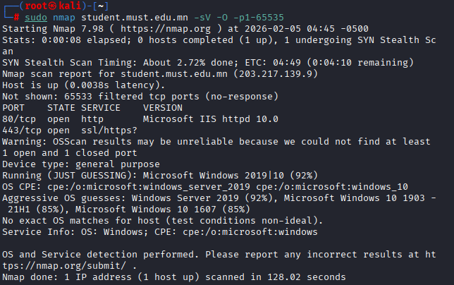
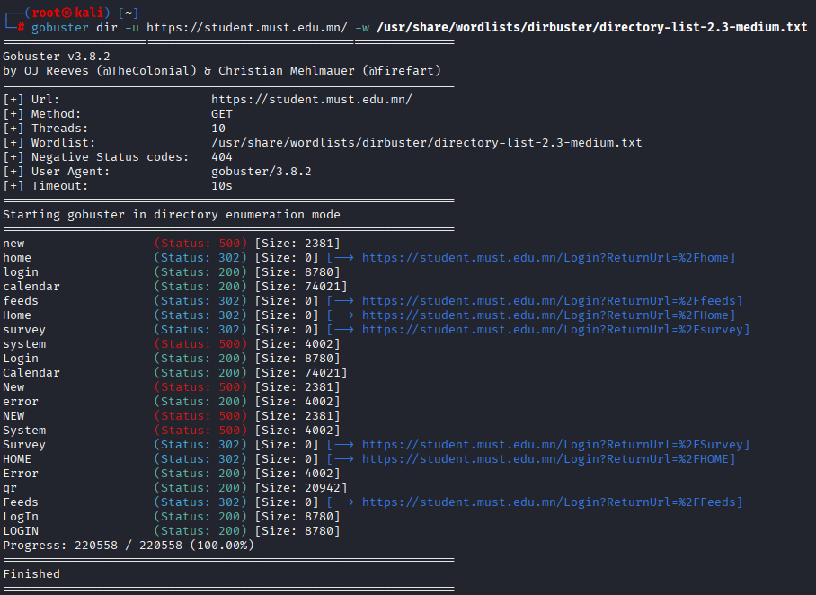
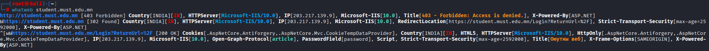
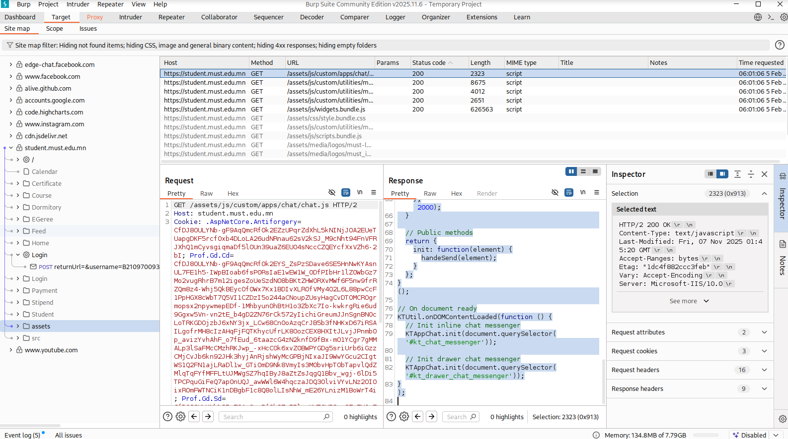
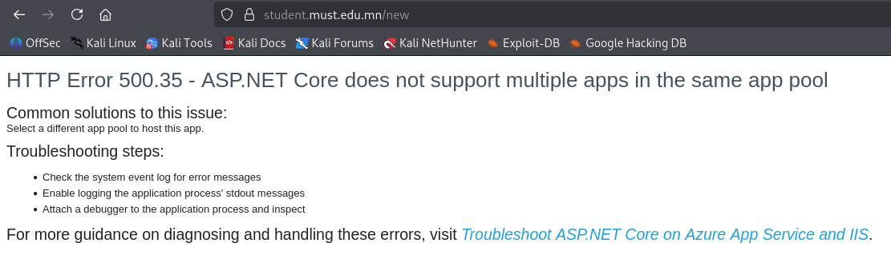
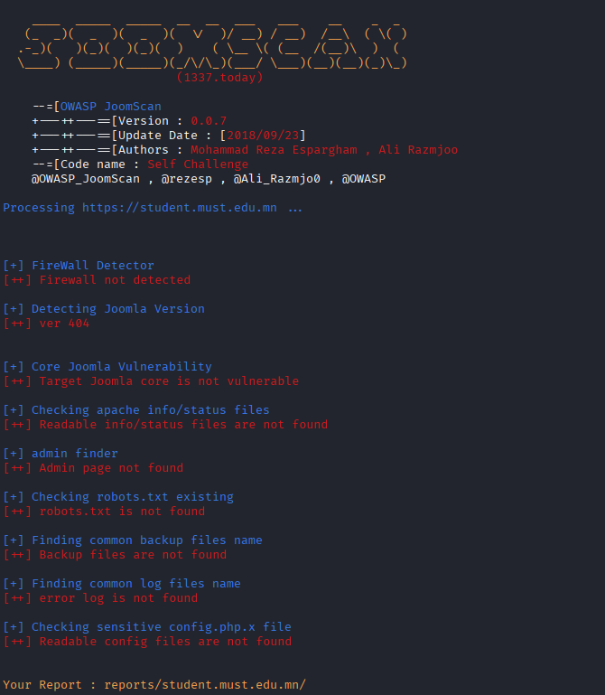
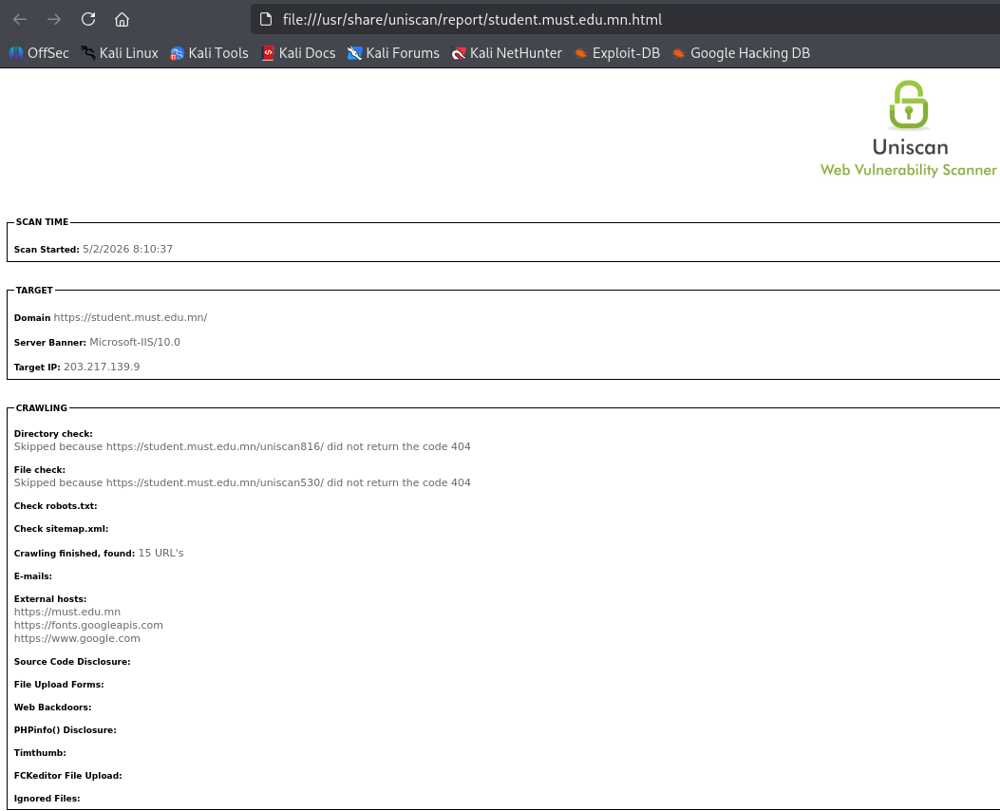
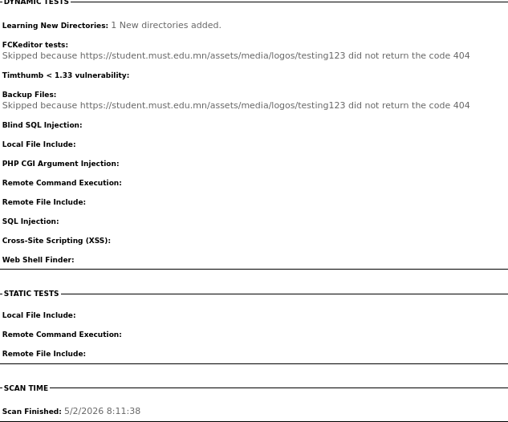
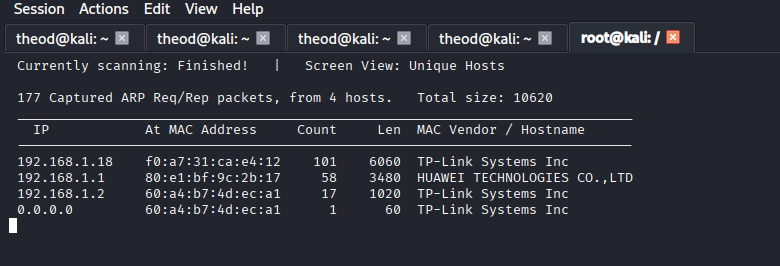

┌──(root㉿kali)-[~]
└─# sudo nmap student.must.edu.mn -sV -O -p1-65535
Starting Nmap 7.98 ( https://nmap.org ) at 2026-02-05 04:45 -0500
Stats: 0:00:08 elapsed; 0 hosts completed (1 up), 1 undergoing SYN Stealth Scan
SYN Stealth Scan Timing: About 2.72% done; ETC: 04:49 (0:04:10 remaining)
Nmap scan report for student.must.edu.mn (203.217.139.9)
Host is up (0.0038s latency).
Not shown: 65533 filtered tcp ports (no-response)
PORT    STATE SERVICE    VERSION
80/tcp  open  http       Microsoft IIS httpd 10.0
443/tcp open  ssl/https?
Warning: OSScan results may be unreliable because we could not find at least 1 open and 1 closed port
Device type: general purpose
Running (JUST GUESSING): Microsoft Windows 2019|10 (92%)
OS CPE: cpe:/o:microsoft:windows_server_2019 cpe:/o:microsoft:windows_10
Aggressive OS guesses: Windows Server 2019 (92%), Microsoft Windows 10 1903 - 21H1 (85%), Microsoft Windows 10 1607 (85%)
No exact OS matches for host (test conditions non-ideal).
Service Info: OS: Windows; CPE: cpe:/o:microsoft:windows

OS and Service detection performed. Please report any incorrect results at https://nmap.org/submit/ .
Nmap done: 1 IP address (1 host up) scanned in 128.02 seconds
                                                                
                                                                

                                                                4️⃣ HSTS байна (САЙН)
Strict-Transport-Security: max-age=2592000

HTTPS албадсан

Downgrade attack-аас хамгаална

👉 Positive finding (тайланд заавал оруул)
                                                                
                                                                Эрсдэл:

Version-д суурилсан халдлагын судалгаа хийх боломж

Fingerprinting

OWASP: A02 – Cryptographic Failures / Information Disclosure

Судалгааны явцад client-side JavaScript ашигласан chat UI илэрсэн. Уг код нь сервертэй өгөгдөл солилцохгүй бөгөөд demo зориулалттай байна. User input-ийг innerText ашиглан render хийж байгаа нь XSS халдлагаас хамгаалсан сайн туршлага юм. Гэвч серверийн технологийн мэдээлэл (IIS, ASP.NET) HTTP header-ээр ил гарч байгаа нь fingerprinting хийх боломж олгож байна.

Static image resource-ийн response-оос харахад сервер нь Microsoft IIS 10.0 болон ASP.NET ашиглаж байна. Энэхүү технологийн мэдээлэл HTTP header-ээр ил гарч байгаа нь серверийн fingerprinting хийх боломж олгож, Security Misconfiguration (OWASP A05) эрсдэл үүсгэж болзошгүй. Харин HSTS хэрэгжсэн нь HTTPS албадалтыг хангаж, эерэг хамгаалалтын жишээ болж байна.

Login процессийн POST request-ийг шинжлэхэд ASP.NET Core-ийн Anti-CSRF хамгаалалт хэрэгжсэн нь илэрсэн. Гэвч brute-force хамгаалалт, account lockout болон CAPTCHA зэрэг нэмэлт authentication hardening хэрэгжсэн эсэх нь passive судалгаагаар тодорхойгүй байна. Мөн returnUrl параметр ашигласан redirect логик нь Insecure Design эрсдэл үүсгэх боломжтой тул whitelist-based validation шаардлагатай.

# joomscan

# uniscan

bolomjit ersdel

## 1 

Yes, ASP.NET applications are subject to various exploits, with recent critical vulnerabilities including HTTP Request Smuggling (CVE-2025-55315) in ASP.NET Core with a 9.9 CVSS score
. Other common threats include SQL injection, Cross-Site Scripting (XSS), insecure deserialization of VIEWSTATE`, and malicious file uploads. 
Key ASP.NET vulnerabilities and risks include:

    Critical HTTP Request Smuggling (CVE-2025-55315): Affects the Kestrel web server, allowing attackers to smuggle requests, bypass security, or escalate privileges.
    Deserialization & Code Injection: Vulnerabilities in VIEWSTATE can allow attackers to read sensitive files like web.config. Insecure handling can lead to remote code execution (RCE) via malicious deserialization.
    Machine Key Exposure: Publicly disclosed machine keys can be used for code injection attacks.
    Common Web Attacks: Unvalidated input leads to SQL Injection (database access) and XSS (client-side script injection). 

Mitigation and Best Practices:

    Patching: Upgrade ASP.NET Core to the latest versions to address CVE-2025-55315.
    Configuration: Disable unused features and strictly validate all user input.
    Machine Keys: Rotate machine keys regularly and ensure they are not hardcoded or exposed.
    Secure Coding: Use built-in ASP.NET protections against XSS and CSR

# 2
Microsoft IIS 10.0 vulnerabilities commonly involve remote code execution, security misconfigurations, and denial of service, often mitigated through regular Windows security updates (e.g.,
MS16-058 or MS17-016). Key threats include IIS Sensitive Authentication Information Disclosure and CVE-2019-0941, a request filtering denial-of-service vulnerability. 
Key Vulnerabilities and Threats in IIS 10.0

    Remote Code Execution (RCE): Historically, vulnerabilities like MS10-065 and MS10-040 could allow attackers to run arbitrary code.
    Denial of Service (DoS): Improper handling of requests in the request filtering feature (CVE-2019-0941) can cause service disruptions.
    Sensitive Authentication Information Disclosure: This is a common, medium-risk vulnerability affecting IIS, often allowing unauthorized access to data.
    Cross-Site Scripting (XSS) and Content Spoofing: Improper sanitization of web requests (e.g., MS17-016) can lead to session hijacking or malicious content injection.
    Security Misconfigurations: Following OWASP Top 10 guidelines is critical, as improper server configuration often leads to vulnerabilities. 

Mitigation Strategies

    Keep IIS Updated: Install all relevant Microsoft security bulletins and Windows updates.
    Disable Unused Features: Minimize the attack surface by disabling unnecessary IIS modules and components.
    Configure Request Filtering: Ensure proper configuration of the Request Filtering feature to prevent DoS attacks.
    Implement SSL/TLS: Use up-to-date encryption to prevent information disclosure. 

Regular auditing and using tools like WAF (Web Application Firewall) help in detecting and blocking potential exploits.